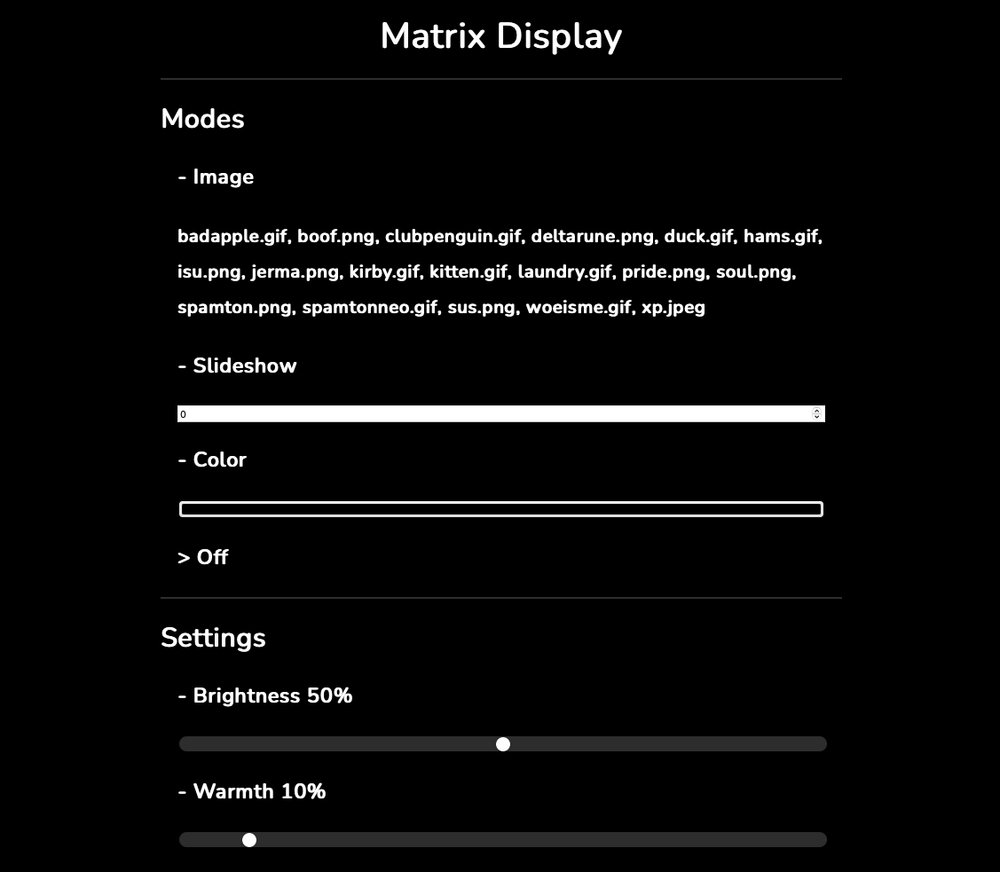

# MatrixDisplay

## About
MatrixDisplay is a Python program used to display images on the Pimoroni Unicorn HAT for Raspberry Pi through a web interface.

## Purpose
This project exists mainly as a way for me to try a new programming language, as well as to create a project that has both software and hardware aspects in it. I also just wanted to make my own smart home gadget.

## Usage
On the same network as the Raspberry Pi, open your browser to `http://yourpihostname.local:8080`. From there, you can control the display output from a web interface.

<div align="center" ></div>

### API
#### GET
- `http://pi-address:8080/ui`: Get web interface
- `http://pi-address:8080/api`: Get device state as JSON

#### POST
- `http://pi-address:8080/api`: Set device state with JSON

#### JSON Format
```json
{
  "mode": "off",
  "image": "image.png",
  "display_time": 0,
  "color": "000000",
  "brightness": 100,
  "warmth": 0
}
```
- `mode`: `image`, `slideshow`, `color`, or `off`
- `image`: Image file name
- `display_time`: Display time for slideshow in seconds
- `color`: Color for color mode in hex
- `brightness`: Display brightness as a percent
- `warmth`: Display warmth as a percent

## Requirements
### Software:
- Python 3
- [unicorn-hat](https://github.com/pimoroni/unicorn-hat) library
- [Pillow](https://pypi.org/project/Pillow/) library

### Hardware:
- Raspberry Pi with the 40-pin header
- [Pimoroni Unicorn HAT](https://shop.pimoroni.com/products/unicorn-hat)
- [Pibow Ninja](https://shop.pimoroni.com/products/pibow-for-raspberry-pi-3-b-plus?variant=2601126395914) case (optional)
- [Pibow Ninja diffuser](https://shop.pimoroni.com/products/pibow-modification-layers?variant=1047619725) Pibow modification layer (optional)
- Micro USB cable for power
- Micro SD card

## Installation
1. Clone or download this repository onto the Raspberry Pi.
2. Set `main.py` to start when the Pi turns on.

## Running
1. Open a terminal.
2. Run `sudo python3 /path/to/main.py`.

## Configuration
There are two configurable values located in `config.py`:
- `pictures_dir`: The location of the directory where images are stored.
- `cache_dir`: The location of the directory where cached images will be saved.

## Demonstration

[Watch on YouTube](https://youtu.be/zxgAzgMzVN0)
